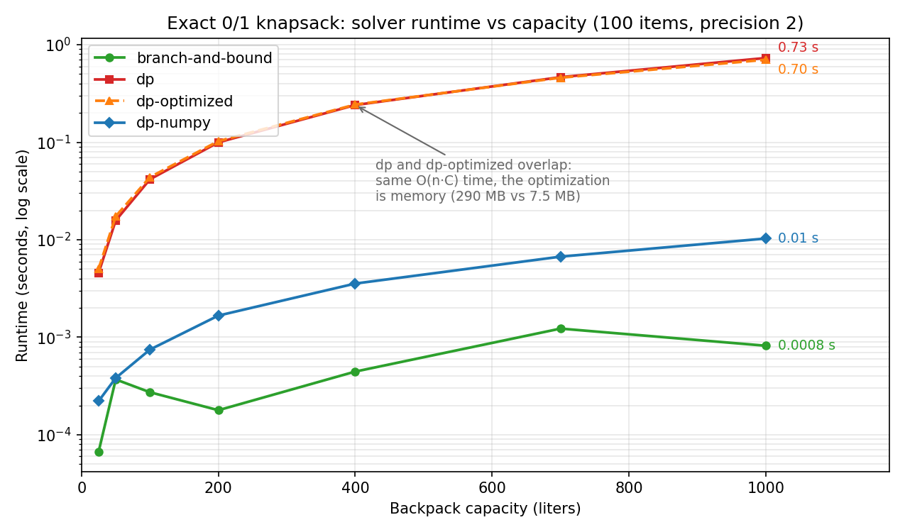

# Bayesian Knapsack

[](https://github.com/oleksii-shcherbak/bayesian-knapsack/actions/workflows/ci.yml)

The task: pick birthday gifts for Sergey with the maximum total price that fit into a
40-liter backpack. The difficulty is that nobody knows the volume of any individual item.
The only data available is 1000 historical packages with noisy measured total volumes.

This repository is a fork of [tim99fn/sergeys_birthday](https://github.com/tim99fn/sergeys_birthday).
The original solution (Bayesian volume estimation + backtracking) is by the original author.
Everything after that is my work: a dynamic programming solver, a memory-optimized DP,
a correctness review with two bug fixes, a branch and bound solver, a vectorized NumPy
solver, benchmarks and a test suite. The whole path is documented in
[History of the solution](#history-of-the-solution) below.

## The problem

- `items.json` – 100 gift candidates, each with a price. Volumes are unknown.
- `packages.json` – 1000 packages: the item IDs inside and the measured total volume
  (measurement error variance = 2).
- Maximize the total price of the selected items. Their true total volume must fit
  into 40 L. No item twice, Sergey doesn't want duplicates.

## How it works

1. **Volume estimation.** Every package is a noisy sum of its items' volumes
   (`P = A·V + ε`). With a Gaussian prior on the volume vector `V` and Gaussian
   measurement noise, the posterior has a closed form (Bayesian linear regression).
   Each item gets its posterior mean as the volume estimate. Items that never appeared
   in any package fall back to the prior mean.

2. **Optimization.** Five exact 0/1 knapsack solvers behind a common interface:

| Solver | File | Idea |
|---|---|---|
| `backtracking` | `solvers/backtracking.py` | the original recursive backtracking, kept as a baseline; exponential (~80 sec already at 40 L) |
| `branch-and-bound` | `solvers/branch_and_bound.py` | the same search with a fractional (LP) bound, works on the raw float volumes |
| `dp` | `solvers/dp.py` | classic DP over discretized volumes with an O(n·C) keep-matrix |
| `dp-optimized` | `solvers/dp_memory_optimized.py` | 1D DP with one selection bitmask per capacity, ~40× less memory than `dp` |
| `dp-numpy` | `solvers/dp_numpy.py` | one vectorized NumPy pass per item, ~60× faster than `dp` |

The DP solvers round volumes **up** to the chosen precision (default 0.01 L) and the
capacity down, so their solutions always fit the real capacity. The benchmark harness
re-checks every result: the selected items must add up to the reported price and fit
into the capacity.

## Result

**751.00 EUR in 39.97 / 40 L**, found by branch and bound:

```
A38 (116€), A6 (109€), A23 (91€), A35 (86€), A48 (81€), A32 (80€),
A44 (76€), A9 (64€), A8 (54€), A53 (44€)
```

The DP solvers return 741 EUR at precision 2 (the price of the fit guarantee after
rounding) and recover the exact 751 at `--precision 3`.

## Benchmarks

Runtime of all four solvers as the backpack capacity grows (100 items, precision 2):



At capacity 1000 L with 100 items:

| Solver | Max Price (EUR) | Time (sec) | Peak Memory (MB) |
|---|---|---|---|
| `branch-and-bound` | 6251.00 | **0.001** | 0.01 |
| `dp` | 6251.00 | 0.718 | 290.06 |
| `dp-optimized` | 6251.00 | 0.704 | 7.54 |
| `dp-numpy` | 6251.00 | **0.012** | 11.93 |

All four solvers select the same 76 items. The original `backtracking` is not in this
table because it cannot finish at this size; the measured comparison against it is in
UPDATED 3.0. Time is measured without instrumentation, peak memory in a separate
`tracemalloc` pass (see the benchmarking note in UPDATED 3.0).

```
python benchmarks/run_benchmarks.py --plot   # reproduces the table and the chart
```

### Easy and hard instances

The benchmark can also run on generated data instead of the real items:
`benchmark --generate N --seed S --correlation C`. Volumes match the real data's range,
and `--correlation` controls how strongly prices follow volumes. That knob matters more
than the instance size. With independent prices branch and bound is practically
unbeatable — but when price is a near-linear function of volume (the classic hard
knapsack case) all price/volume densities collapse towards a constant, the fractional
bound stops discriminating between branches, and the search turns exponential again.
The DP solvers don't notice the difference: their cost is exactly n·C cells either way.

Same 300 items, same 1800 L capacity, only the correlation changes:

| Correlation | branch-and-bound | dp-numpy |
|---|---|---|
| 0.0 (independent prices) | **0.001 sec** | 0.055 sec |
| 1.0 (price ≈ 4 × volume) | timeout, > 60 sec | **0.061 sec** |

So the practical rule: **branch and bound** for real-world-ish data at any capacity,
**dp-numpy** when the runtime must be predictable no matter what the instance looks
like (or when prices correlate with volumes), **dp-optimized** when memory is the
constraint. Reproduce with:

```
python solve_knapsack.py benchmark --generate 300 --capacity 1800 --seed 5 \
    --correlation 1 --algorithms branch-and-bound,dp-numpy --timeout 60
```

## How to run

```bash
pip install -r requirements.txt

python solve_knapsack.py solve                       # the answer to the original 40 L problem
python solve_knapsack.py solve --algorithm dp-numpy --precision 3

python solve_knapsack.py benchmark                   # compare the fast solvers on the real data
python solve_knapsack.py benchmark --capacity 1000   # the large benchmark
python solve_knapsack.py benchmark --algorithms backtracking,branch-and-bound   # ~80 sec vs ~1 ms
python solve_knapsack.py benchmark --generate 300 --capacity 1800 --correlation 1 --timeout 60

python -m pytest tests/                              # incl. fuzz of every solver vs brute force
```

By default `benchmark` skips the original `backtracking` (it needs ~80 sec at 40 L);
`--algorithms all` includes it, and `--timeout N` keeps any solver from running away.
Add `--verbose` to see the full volume estimation details.

---

## History of the solution

I keep the full history in this README on purpose: it shows how the solution developed
over time. The benchmark numbers in each section are the ones measured back then.

### Original solution

Bayesian estimation of the individual item volumes from the package data, then recursive
backtracking over the items. On the original 60-item dataset it found a basket of
741.00 EUR filling 39.95 / 40 L. The algorithm is kept in `solvers/backtracking.py` and
still runs in the benchmarks.

### UPDATED – Dynamic Programming

I forked this repository to explore how the solution could be improved when the number
of items increases.

The backtracking algorithm works well for small and medium input sizes, but becomes too
slow on large ones. So I added an alternative approach using **dynamic programming**.
It's much faster, but it only works with integers — so I had to **convert decimal volumes
to integers** by discretizing them (e.g., multiplying by 100).

Here's a quick benchmark:

| Algorithm              | Max Price (EUR) | Time (sec) | Total Volume Used (L) |
|------------------------|------------------|-------------|-------------------------|
| Backtracking           | 751.00           | 70.461      | 39.97 / 40.0            |
| Dynamic Programming    | 757.00           | 0.010       | 40.00 / 40.0            |

I did not change the original algorithm. I added a separate DP implementation
(`dp_solver.py`), extended the dataset from 60 to 100 items to make the scaling visible,
and benchmarked both methods on the same input.

> **Note (added in UPDATED 3.0):** the DP's 757 turned out not to be a better answer.
> Rounding volumes to the *nearest* 0.01 L let it pack a basket whose true volume was
> 40.0049 L, so it didn't actually fit. Backtracking's 751 was the correct optimum.

### UPDATED 2.0 – Optimized Dynamic Programming

In this updated version, the dynamic programming algorithm has been reworked to
significantly improve **space** and **execution time** efficiency.

#### Key Improvements:
- **Space Complexity reduced** from `O(n · C)` to `O(C)`,
  where `n` is the number of items and `C` is the scaled capacity of the backpack.
- Replacing the 2D DP matrix with a 1D DP array.
- Iterating over the capacity in **reverse order**, which ensures correct overwriting
  of previous states without interference.

#### Benchmark Results
> Benchmarks were performed with backpack capacity **1000 liters** and **100 items**.
> The backtracking solution was excluded because at this size its runtime grows
> exponentially, making it practically infeasible to run.

| Algorithm                     | Max Price (EUR) | Time (sec) | Peak Memory (MB) |
|------------------------------|------------------|-------------|------------------|
| DP (discretized)             | 6251.00          | 21.174      | 229.04           |
| DP (optimized)               | 6251.00          | 12.591      | 3.91             |

Both variants produced identical solutions. The optimized version required **~98% less
memory** and executed **~40% faster**.

> **Note (added in UPDATED 3.0):** "identical solutions" was a property of this dataset,
> not of the algorithm. The optimized reconstruction had a latent bug, found and fixed
> in UPDATED 3.0.

### UPDATED 3.0 – Correctness review and faster solvers

Before pinning this repository I reviewed my own previous updates, found two real bugs,
fixed them, and added two faster solvers and a test suite.

#### Bug 1: the memory-optimized DP could return a wrong item list

The UPDATED 2.0 solver kept a single `item_choice[c]` pointer per capacity cell (the
last item that improved `dp[c]`) and walked these pointers backwards to rebuild the
selection. That is not sound: an item processed later can overwrite a cell that an
earlier chain passed through, so the walk can jump between incompatible chains.

Minimal counterexample with capacity 4: items X (price 3, vol 2), Y (3, 2), Z (4, 2).
The optimum is X+Z = 7. The old solver reported `total_price: 7` with
`selected_items: ['Z']`, a basket worth only 4.

The fix: every capacity cell now stores the exact achieving set as an integer bitmask
(`selection[c] = selection[c - w] | (1 << i)`). The returned items always match the
reported price, and the memory stays small (O(C · n/64) machine words). The fix costs
about 4% runtime compared to the broken version (0.66 → 0.69 sec at 1000 L) — a cheap
price for correctness. There is a regression test for this exact case.

#### Bug 2: discretized solutions could exceed the real capacity

Volumes used to be rounded to the **nearest** 0.01 L, which is what produced the
infeasible 757 in UPDATED. Volumes are now rounded **up** and the capacity **down**, so
every returned basket is guaranteed to fit. At precision 2 this guarantee costs 10 EUR
on this data (741 vs 751); precision 3 recovers the exact optimum.

#### A benchmarking mistake

The UPDATED and UPDATED 2.0 timings were taken with `tracemalloc` active, which slows
the pure-Python DP loops by roughly 50× (every cell write allocates a tracked object).
Measured cleanly, the optimized DP runs 1000 L in ~0.7 sec, not the 12.6 sec its own
table records. The harness now times an uninstrumented run and measures peak memory in
a second pass. The historical tables above are kept as they were measured back then.

#### New solver: branch and bound (`solvers/branch_and_bound.py`)

The same depth-first search as the original backtracking, with one change that makes
all the difference: the pruning bound. The original prunes a branch only when even the
sum of **all** remaining prices cannot beat the best solution so far — the capacity is
ignored, so the bound is thousands of euros too optimistic and almost never fires. The
new solver uses the fractional (LP relaxation) bound instead: greedily fill the
remaining capacity with the densest remaining items, taking a fraction of the first one
that doesn't fit. With items in density order the very first descent already lands on a
near-optimal solution, and the tight bound then cuts almost every other branch
immediately.

The speedup looked too good to be true, so the original algorithm stays in the repo
(`solvers/backtracking.py`) and both were measured on the same data, counting search
nodes with an instrumented copy:

| Algorithm | Capacity | Search nodes | Time | Result (EUR) |
|---|---|---|---|---|
| backtracking (original) | 40 L | 114,258,907 | 83.3 sec | 751.00 |
| branch and bound | 40 L | 169 | < 1 ms | 751.00 |
| backtracking (original) | 1000 L | 30,801,920, then stopped | 15 sec budget | 6246.00 so far, not optimal |
| branch and bound | 1000 L | 1,147 | < 1 ms | 6251.00 |

Same answers, ~676,000× fewer nodes at 40 L. The 6251.00 at 1000 L also matches what
both DP variants have computed since UPDATED 2.0, so the speed does not come at the
cost of correctness. The 40 L comparison is reproducible with:

```
python solve_knapsack.py benchmark --algorithms backtracking,branch-and-bound
```

Branch and bound is not unconditionally fast, though — its weakness is shown in
[Easy and hard instances](#easy-and-hard-instances) above: when prices correlate with
volumes, the bound stops pruning and DP takes over.

#### New solver: vectorized DP (`solvers/dp_numpy.py`)

The DP vectorized with NumPy: one pass over the dp array per item, plus a boolean
keep-matrix for exact reconstruction of the selection. About 60× faster than the
pure-Python DP at capacity 1000 L.

#### Tests

The pytest suite covers: a regression test for bug 1, 150 random instances per solver
verified against brute-force enumeration (the original backtracking included), edge
cases (empty input, nothing fits, exact fit), price/volume consistency of every result,
the instance generator, and an end-to-end run on the repository data checking that all
fast solvers agree.

#### Cleanup and a benchmark playground

After three updates the flat scripts had grown into a mess, so the final pass
reorganized them: all five algorithms live in a `solvers/` package behind one
interface, the Bayesian part moved to `estimation.py`, and the CLI got two subcommands
— `solve` for the actual answer and `benchmark` for comparisons — plus a synthetic
instance generator (`--generate`, `--seed`, `--correlation`) and a per-solver
`--timeout`. The generator is what produced the easy/hard instance comparison in the
benchmark section above: it turned out the interesting dial is not the instance size
but the price-volume correlation.

## Project structure

```
solve_knapsack.py                 CLI: solve / benchmark subcommands, generator, timeout
estimation.py                     Bayesian volume estimation from the package data
solvers/
    __init__.py                   the SOLVERS registry (one interface for all five)
    backtracking.py               the original backtracking (baseline)
    branch_and_bound.py           branch and bound (exact, float volumes)
    dp.py                         baseline DP (keep-matrix)
    dp_memory_optimized.py        1D DP + selection bitmasks
    dp_numpy.py                   vectorized DP
    discretization.py             shared volume rounding for the DP solvers
benchmarks/run_benchmarks.py      capacity sweep + chart
tests/test_solvers.py             tests (regression, fuzz, edge cases, generator, e2e)
items.json / packages.json        the data
```

## Credits

The task, the data and the original solution (Bayesian estimation + backtracking) come
from [tim99fn/sergeys_birthday](https://github.com/tim99fn/sergeys_birthday), which this
repository is forked from. Everything from UPDATED onward is mine.
